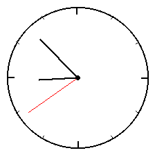
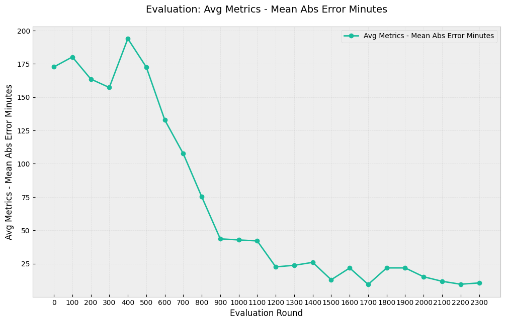
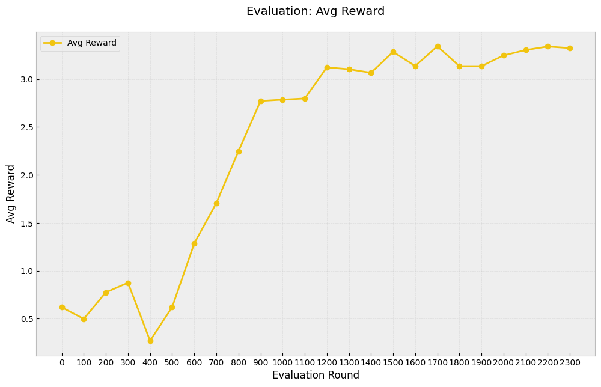

# DeepSeek R1 Implementation

## Motivation
I wanted to recreate DeepSeek R1's  results at a smaller scale, focusing on understanding the core mechanics by implementing everything from scratch. So this is a repo that trains Qwen1.5B on the [grade school math dataset](https://github.com/openai/grade-school-math).

This implementation heavily borrows from [Will Brown's  work](https://gist.github.com/willccbb/4676755236bb08cab5f4e54a0475d6fb) ([@willccbb](https://x.com/willccbb)), but restructures the code into a format optimized for learning and experimentation.

The key difference in my implementation is computing the GRPO loss function directly rather than using external RL libraries, and reformatting into a multi script repo.

I hope this might help other people understand things better, and maybe provide an easier way to try out smaller scale ideas etc. 

## Installation
```
pip install -r requirements.txt
```

Required environment variables:
```
export HUGGINGFACE_TOKEN="your-token-here"
huggingface-cli login
```

## Implementation Details

The system consists of several key modules:

### main.py
Contains the core training loop implementing GRPO (Generalized Reward-Powered Optimization). Handles model training, evaluation, and metric tracking. 

### llms.py 
Manages model loading and configuration, currently supporting LLaMA + Qwen models through Hugging Face's transformers library. Designed to be easily extensible to other model architectures.

### rldatasets.py
Handles dataset loading and preprocessing, currently focused on GSM8K math problems. Implements custom data loaders for both training and evaluation.

### evaluator.py
Contains evaluation metrics and reward functions, closely following DeepSeek's original implementation.

## Results
Training was conducted on a single H100 GPU. After ~400 training steps:


And results on the validation set - this shows a clearer sign of learning: 


## Clock Reading Task: Geometric Reasoning with VLMs

To further explore the capabilities of this RL approach, particularly for tasks requiring spatial and geometric reasoning, I implemented a clock reading task using a Vision-Language Model (Qwen-VL).

### The Task
The core idea is to train the VLM to accurately read the time displayed on an analog clock face.
1.  **Image Generation:** Synthetic analog clock images are generated, each displaying a specific, randomly chosen time (hour, minute, second).
    ```python
    # Example of clock generation logic (simplified)
    # clock_image = generate_clock_image(hour, minute, second)
    ```
    Here's an example of a generated clock face:
    

2.  **Model Input:** The VLM receives the generated clock image and a prompt asking for the time displayed.
3.  **Model Output:** The model is expected to output the time in a structured format (e.g., HH:MM:SS) within designated tags (e.g., `<answer>HH:MM:SS</answer>`).
4.  **Reward Calculation:** The reward signal is directly tied to the accuracy of the predicted time. The absolute difference (in seconds) between the model's predicted time and the ground truth time is calculated. This difference is then used to compute a reward, where smaller time differences yield higher rewards. This incentivizes the model to learn the geometric relationships between the clock hands (hour, minute, second) and their corresponding time values.

### Results on Clock Reading
The GRPO training process proved effective for this task as well. The model significantly improved its ability to read the analog clocks over several evaluation rounds.

-   **Mean Absolute Error:** The plot below shows the average error (in minutes) between the predicted time and the actual time. Initially, the model's predictions were off by nearly 3 hours (around 180 minutes), but through training, this error decreased dramatically to approximately 10 minutes.
    

-   **Average Reward:** Correspondingly, the average reward per evaluation example increased, reflecting the model's improved accuracy.
    

These results demonstrate the potential of using reinforcement learning techniques like GRPO to enhance the geometric and spatial reasoning capabilities of VLMs on specialized tasks.

### Running the Clock Experiment

To replicate or experiment with the clock reading task:

1.  **Dataset:** The clock images are generated on-the-fly during training and evaluation. The dataset configuration within `rldatasets.py` (`ClockDataset`) handles the generation of random times and rendering the corresponding clock images using the `ClockImageGenerator` class found in `clock_image_generator.py`. No separate dataset download or preparation is required.

2.  **Configuration:** Modify the `main.py` script or use command-line arguments to set the following:
    *   `--model_path`: Specify the path to the Qwen-VL model (e.g., `Qwen/Qwen-VL-Chat`).
    *   `--dataset_name`: Set this to `"clock"` to use the `ClockDataset`.
    *   `--output_dir`: Define a directory to save logs, plots, and model checkpoints.
    *   Adjust other hyperparameters as needed (e.g., learning rate, batch size, evaluation frequency).

3.  **Run Training:** Execute the main script:
    ```bash
    python main.py \
        --model_path Qwen/Qwen-VL-Chat \
        --dataset_name clock \
        --output_dir ./clock_experiment_output \
        --num_train_epochs 5 \
        --eval_steps 50
        # Add other relevant arguments
    ```

4.  **Monitor Results:** Training logs (`train_logs.json`) and evaluation metrics/plots (`eval_logs/`) will be saved in the specified `output_dir`. The `plotter.py` script can be used to visualize the results (`python plotter.py --output_dir ./clock_experiment_output`).

## Citation
If you find this repository useful, please consider citing:
```bibtex
@misc{hogan2024deepseek_rl_extended,
  author = {Hogan, Brendan},
  title = {DeepSeekRL-Extended},
  year = {2024},
  publisher = {GitHub},
  journal = {GitHub repository},
  url = {https://github.com/brendanhogan/DeepSeekRL-Extended}
}
```


